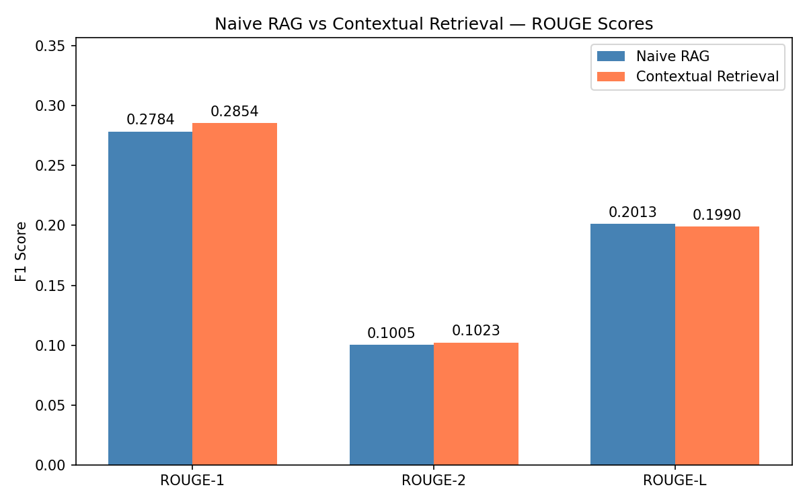
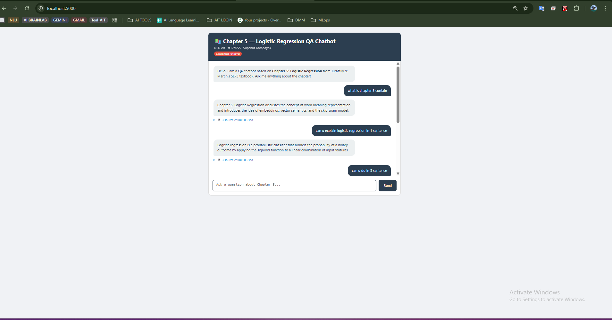

# NLU A6: Naive RAG vs Contextual Retrieval

**Student:** Supanut Kompayak
**ID:** st126055
**Course:** AT82.03 Machine Learning
**Chapter:** 5 — Logistic Regression (Jurafsky & Martin, SLP3)

---

## Overview

This assignment builds a domain-specific QA system based on **Chapter 5 (Logistic Regression)** of the Jurafsky & Martin SLP3 textbook and compares two retrieval strategies:

| Strategy | Description |
|---|---|
| **Naive RAG** | Standard vector retrieval on raw text chunks |
| **Contextual Retrieval** | Each chunk is enriched with a 1–2 sentence LLM-generated context prefix before embedding |

**Models used:**
- Retriever: `BAAI/bge-small-en-v1.5` (local, sentence-transformers)
- Generator: `llama-3.1-8b-instant` (Groq free tier)
- Vector store: ChromaDB (cosine similarity)

---

## Project Structure

```
A6/
├── Dockerfile
├── docker-compose.yml
├── requirements.txt
├── README.md
├── .gitignore
├── notebooks/
│   └── st126055_Supanut_A6_RAG.ipynb   ← Tasks 1 & 2
├── app/                                 ← Task 3 — Flask chatbot
│   ├── app.py
│   ├── rag.py
│   └── templates/
│       └── index.html
├── data/                                ← Generated data (not committed)
│   ├── chapter5.pdf
│   ├── chapter5_clean.txt
│   ├── enriched_chunks.json
│   └── chroma/
├── answer/
│   └── response-st126055-chapter-5.json
└── screenshots/
    └── rouge_comparison.png
```

---

## How to Run

### 1. Set your Groq API key

Create a `.env` file in the `A6/` root:

```bash
GROQ_API_KEY=gsk_...
```

Get a free key at [console.groq.com](https://console.groq.com) — no credit card required.

### 2. Build & start Docker

```bash
docker-compose up --build
```

This starts JupyterLab on port **8890**.

### 3. Run the notebook (Tasks 1 & 2)

Open `http://localhost:8890` (password: `password`) and run:
```
notebooks/st126055_Supanut_A6_RAG.ipynb
```

This will:
- Download and clean Chapter 5 from the SLP3 textbook
- Split the document into overlapping chunks (500 words, 100 overlap)
- Build the **Naive RAG** vector database (raw chunks)
- Enrich chunks with Groq LLM context prefixes → build **Contextual Retrieval** vector database
- Run all 20 QA pairs through both pipelines
- Compute ROUGE-1, ROUGE-2, ROUGE-L scores
- Save results to `answer/response-st126055-chapter-5.json`

### 4. Start the Flask chatbot (Task 3)

Open a terminal inside JupyterLab and run:

```bash
cd /workspace/app
python app.py
```

Visit `http://localhost:5000` to use the chatbot. It uses the **Contextual Retrieval** backend and displays the source chunks used to generate each answer.

---

## Evaluation Results

| Method               | ROUGE-1 | ROUGE-2 | ROUGE-L |
|----------------------|---------|---------|---------|
| Naive RAG            | 0.2784  | 0.1005  | 0.2013  |
| Contextual Retrieval | **0.2854**  | **0.1023**  | 0.1990  |



---

## Web Application



The chatbot uses the **Contextual Retrieval** backend and displays the source chunks used to generate each answer.

---

## Key Findings

**Contextual Retrieval outperforms Naive RAG on ROUGE-1 (+0.0070) and ROUGE-2 (+0.0018).** By prepending each chunk with an LLM-generated context summary, the retriever better understands what each chunk covers relative to the full document — bridging vocabulary gaps between user queries and raw document text.

ROUGE-L is marginally lower for Contextual Retrieval (-0.0023), which is expected: the richer context prefix causes the generator to paraphrase differently, reducing longest-common-subsequence overlap even when the semantic content is more accurate. ROUGE measures lexical overlap, not semantic quality.
